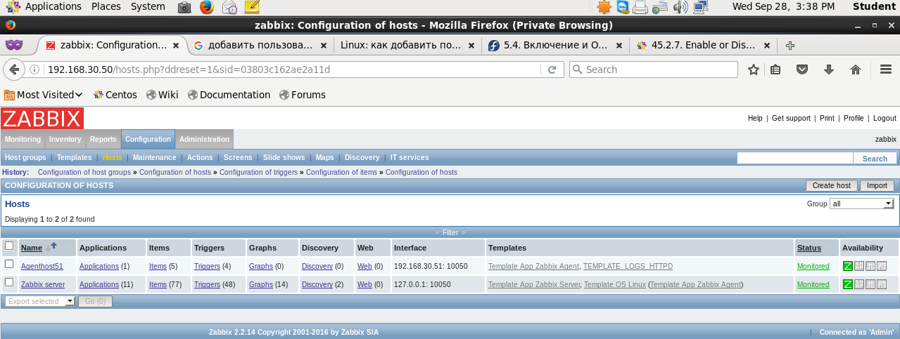
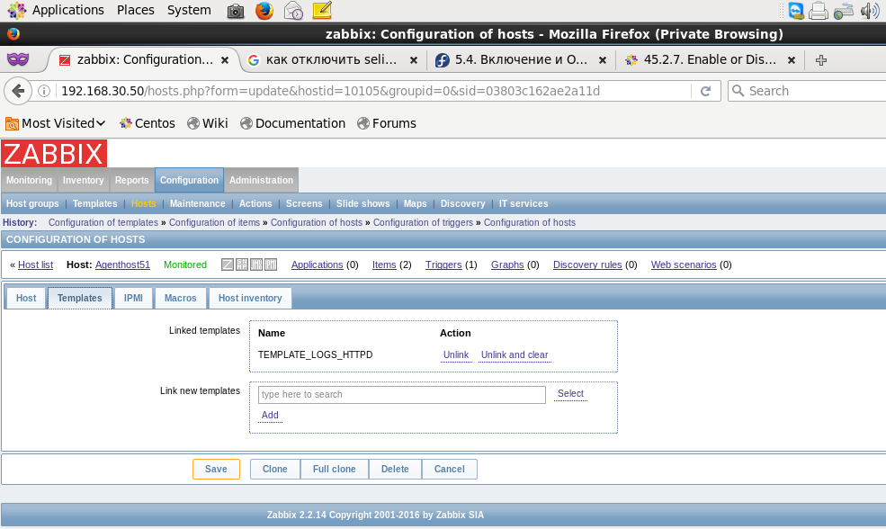
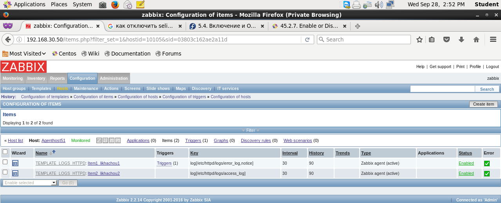
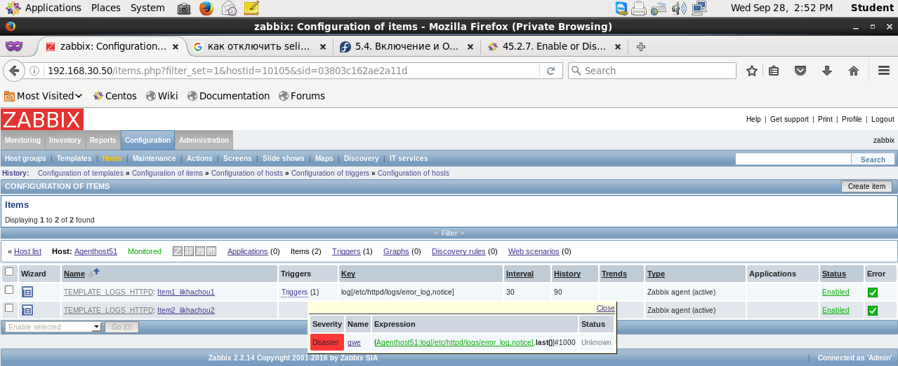
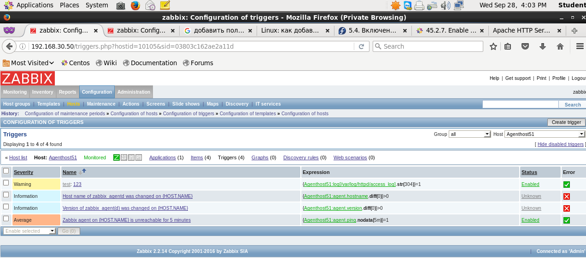
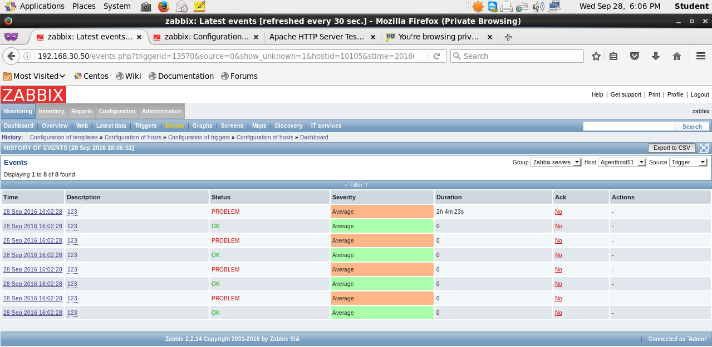
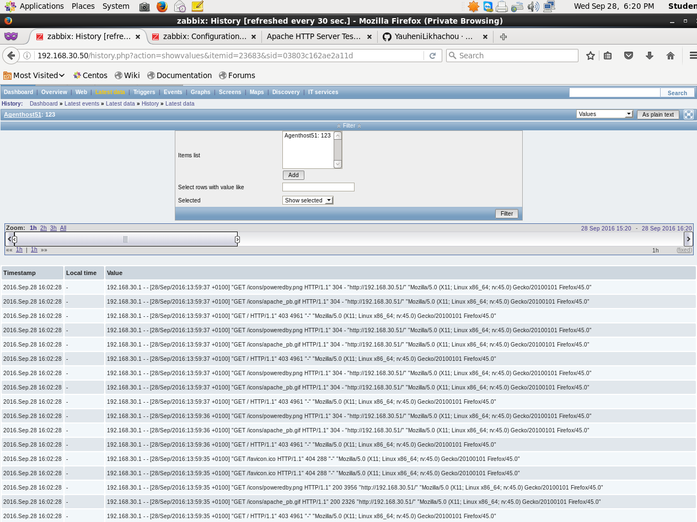
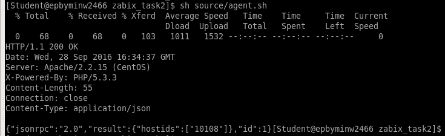
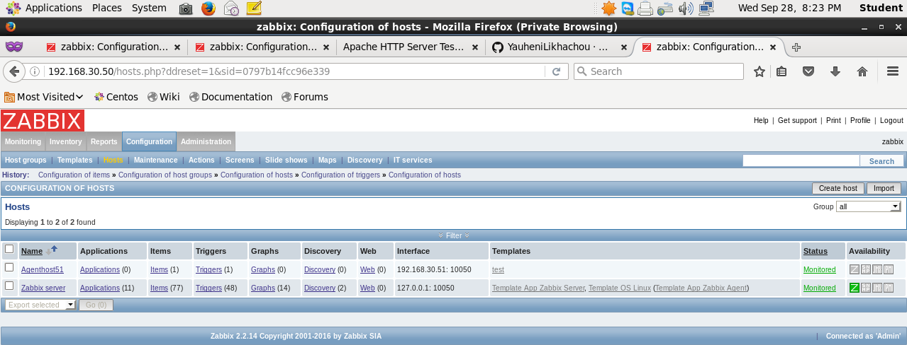

# Zabbix task_2

## Configs:
##### => [Vagrantfile](Vagrantfile)
##### => [Out log of vagrant](outvagrant_task2.log)
##### => [provision file](source/provision.yml)
##### => [Script](source/agent.sh)
##### => [zabbix server config](source/zabbix_agentd.conf)

##

## Screenshots:

