# Zabbix task_1

## Configs:
##### => [Vagrantfile](Vagrantfile)
##### => [Out log of vagrant](outvagrant.log)
##### => [conf.cnf](source/conf.cnf)
##### => [provision file](source/provision.yml)
##### => [zabbix config](source/zabbix.conf)
##### => [zabbix server config](source/zabbix_server.conf)

##

## Screenshots:
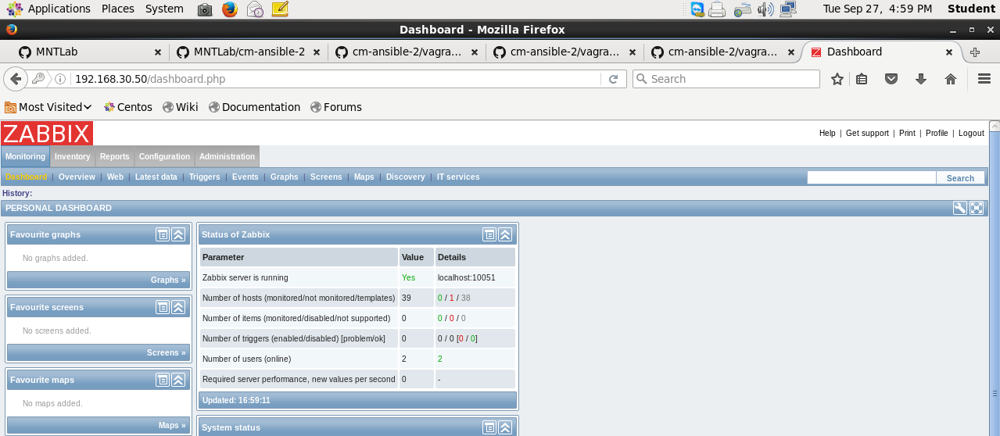
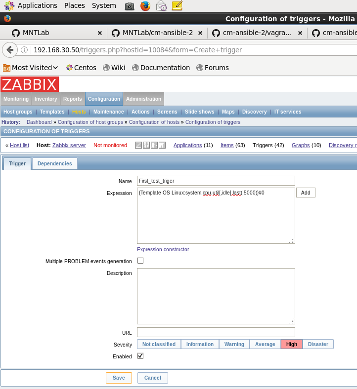
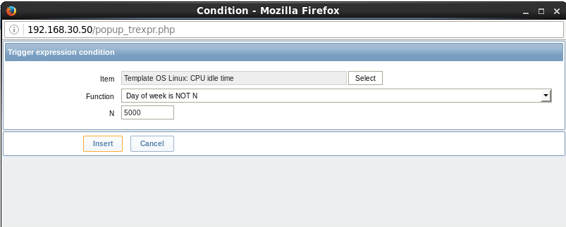
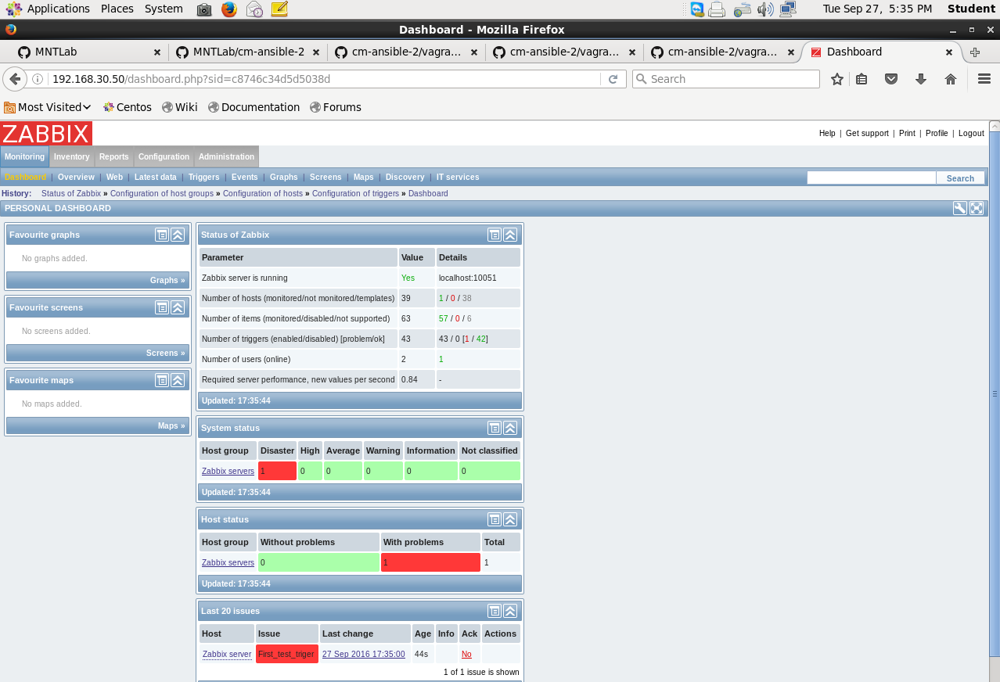
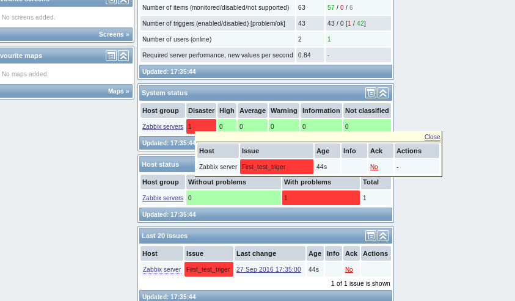
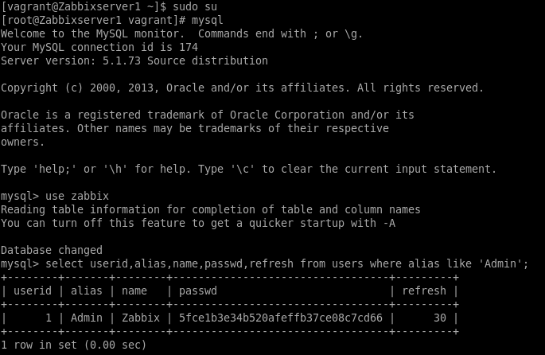
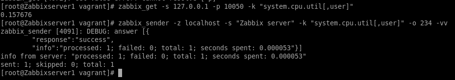
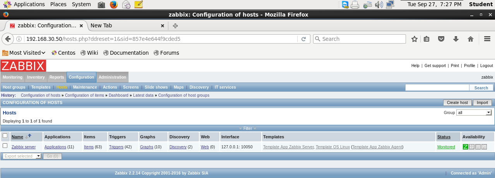
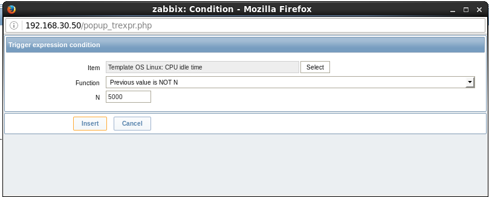
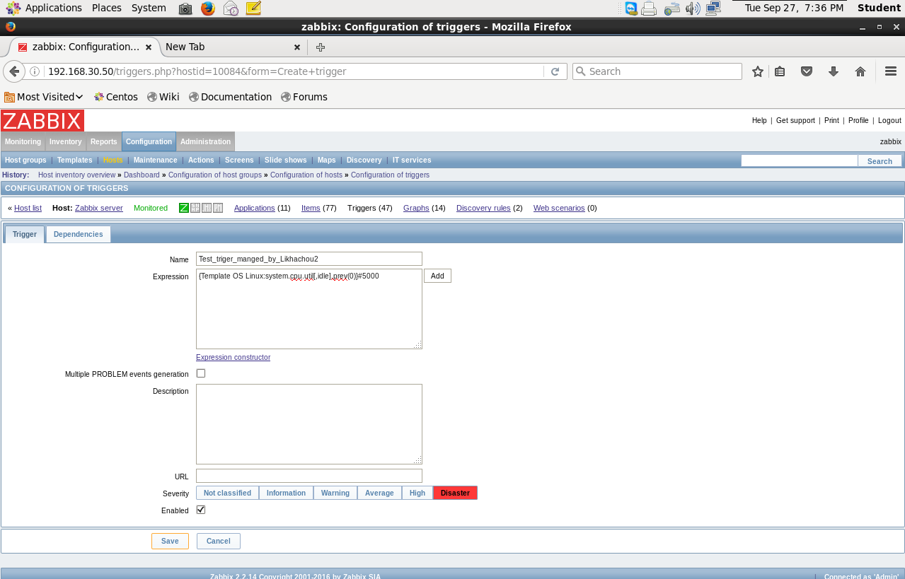
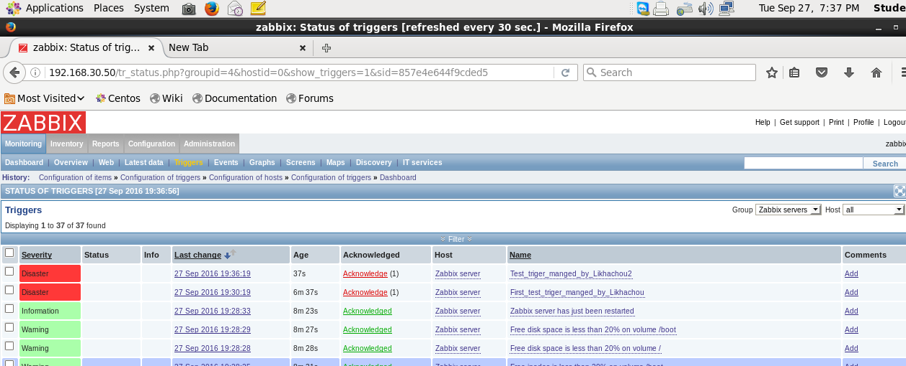
